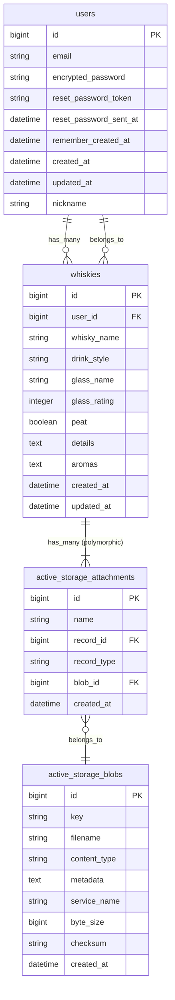

# Malt Log データベース設計

## 概要

このドキュメントは、ウイスキー試飲記録アプリケーション「Malt Log」のデータベーススキーマについて説明します。

## ER図 (Mermaid記法)

## テーブル定義

### `users`

アプリケーションのユーザー情報を格納します。Deviseによって管理されます。

| カラム名               | データ型   | 説明                               |
| ---------------------- | ---------- | ---------------------------------- |
| `id`                   | `bigint`   | 主キー                             |
| `email`                | `string`   | メールアドレス (ログインID)        |
| `encrypted_password`   | `string`   | 暗号化されたパスワード             |
| `nickname`             | `string`   | ユーザーのニックネーム             |
| `reset_password_token` | `string`   | パスワードリセット用トークン       |
| `reset_password_sent_at` | `datetime` | パスワードリセットメール送信日時   |
| `remember_created_at`  | `datetime` | 「ログイン状態を保持」の作成日時   |
| `created_at`           | `datetime` | 作成日時                           |
| `updated_at`           | `datetime` | 更新日時                           |

### `whiskies`

ユーザーが記録したウイスキーの試飲ログ情報を格納します。

| カラム名        | データ型   | 説明                                     |
| --------------- | ---------- | ---------------------------------------- |
| `id`            | `bigint`   | 主キー                                   |
| `user_id`       | `bigint`   | 投稿したユーザーの外部キー (`users.id`)  |
| `whisky_name`   | `string`   | ウイスキーの銘柄名                       |
| `drink_style`   | `string`   | 飲み方 (例: `straight`, `highball`)      |
| `glass_name`    | `string`   | 使用したグラス名                         |
| `glass_rating`  | `integer`  | グラスとの相性評価 (1-5)                 |
| `peat`          | `boolean`  | ピートの有無                             |
| `details`       | `text`     | テイスティングノートなどの詳細           |
| `aromas`        | `text`     | 香りのタグ (配列をシリアライズして保存)  |
| `created_at`    | `datetime` | 作成日時                                 |
| `updated_at`    | `datetime` | 更新日時                                 |

### `active_storage_blobs`

アップロードされたファイル（画像など）の実データを格納します。

### `active_storage_attachments`

各モデルレコードとアップロードされたファイル(`active_storage_blobs`)を関連付ける中間テーブルです。`whiskies`テーブルの`whisky_photo`と`glass_photo`がこのテーブルを介してファイルと紐付きます。

## モデルの関連付け (アソシエーション)

- **User - Whisky**
  - `User`は多数の`Whisky`を持つ (`has_many :whiskies`)
  - `Whisky`は1人の`User`に属する (`belongs_to :user`)
- **Whisky - Photo**
  - `Whisky`はボトルの写真とグラスの写真をそれぞれ1つずつ持てる (`has_one_attached :whisky_photo`, `has_one_attached :glass_photo`)

